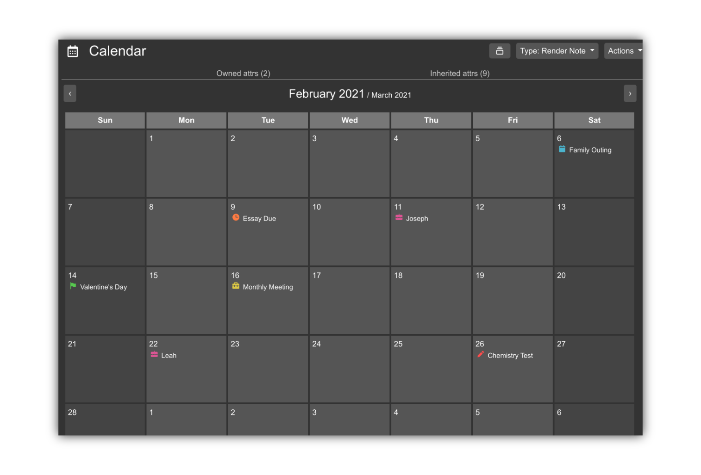

# Trilium Scripts
This is a collection of scripts I made for the awesome note-taking platform [Trilium](https://github.com/zadam/trilium).

## Installation
Check the [wiki](https://github.com/Mangiola/trilium-scripts/wiki) for installation and usage guides. 
