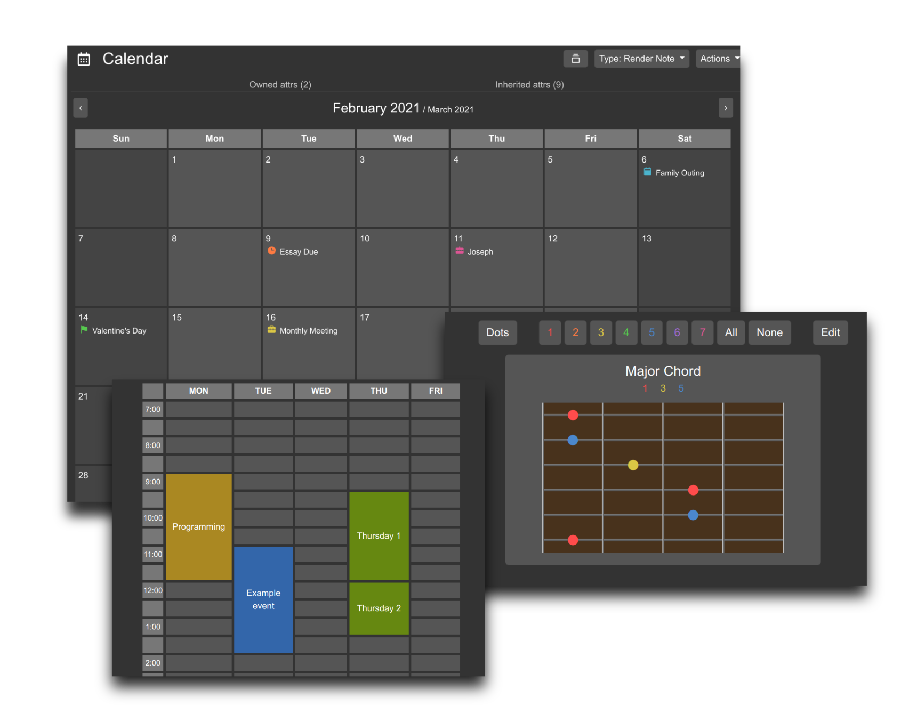

# Trilium Scripts
This is a collection of scripts I made for the awesome note-taking platform [Trilium](https://github.com/zadam/trilium). 

These are all quick, one-file programs solely for use in Trilium; code neatness wasn't exactly a priority. However, I added plenty of comments in case you'd like to edit them. Some scripts are written in vanilla JavaScript and some use jQuery.

## Installation
Check the [wiki](https://github.com/Mangiola/trilium-scripts/wiki) for installation and usage guides. 
